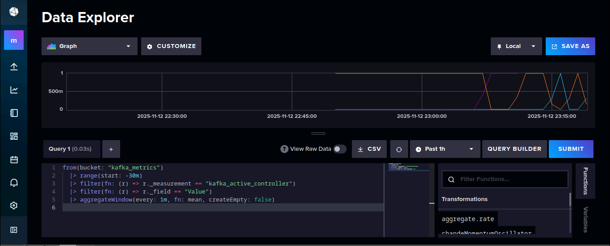
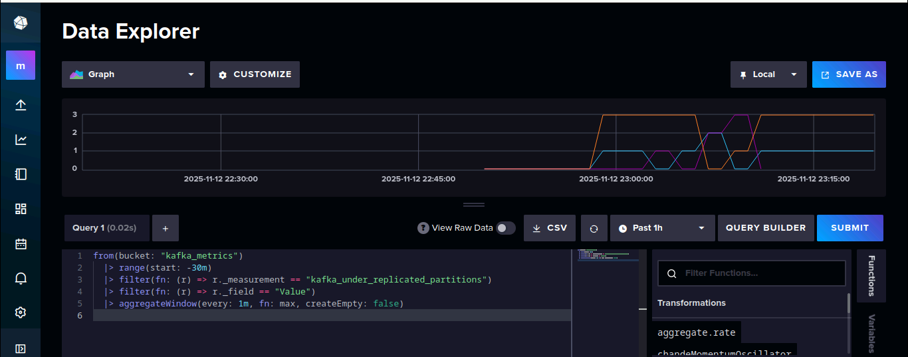

<p align="center"><b>Mamadou Cherif DIALLO - Master 2 Informatique</b></p>

# TP2 ADMINISTRATION BASE DE DONNEES

## Présentation

Dans ce TP, nous déployons un environnement d’observabilité pour un cluster Kafka composé de trois brokers, avec collecte de métriques via **Jolokia2** et **Telegraf**, stockage des données dans **InfluxDB**, et visualisation avec un tableau de bord. L’objectif est de comprendre la configuration, le flux de données, la métrologie et la résilience du cluster.

---

## Analyse de l'environnement

### 1. Organisation du fichier `docker-compose.yml`

Le fichier est structuré autour de plusieurs **services Docker** :

* **Kafka cluster** : kafka-1, kafka-2, kafka-3
* **Observabilité / monitoring** : telegraf, influxdb, jolokia2 (intégré aux brokers)
* **Producteurs et consommateurs** : init-producer, consumer-1 → consumer-4
* **Outils de visualisation et gestion des topics** : kafdrop
* **Initialisation** : topic-init

Chaque service définit :

* **image/build** : image Docker ou dossier à construire
* **container_name et hostname**
* **ports exposés**
* **volumes**
* **variables d’environnement**
* **dépendances (`depends_on`)**

---

### 2. Organisation de l'application et schéma simplifié

Le flux global :

1. **init-producer** envoie des messages dans le topic `weather`.
2. Les **brokers Kafka** stockent et répliquent les messages.
3. **Consumers** lisent les messages depuis le topic.
4. **Telegraf**, via **Jolokia2**, collecte les métriques Kafka et les envoie à **InfluxDB**.
5. **Kafdrop** fournit une interface graphique pour observer les topics et les partitions.

#### Schéma simplifié

```
            ┌──────────────┐
            │ init-producer│
            └──────┬───────┘
                   │
                   ▼
          ┌─────────────────┐
          │   Kafka Cluster │
          │ ┌─kafka-1─────┐ │
          │ ├─kafka-2─────┤ │
          │ └─kafka-3─────┘ │
          └─────┬───────────┘
                │
   ┌────────────┴────────────┐
   │       Consumers         │
   │ consumer-1 → consumer-4 │
   └────────────┬────────────┘
                │
                ▼
   ┌─────────────────────────┐
   │        Telegraf         │
   │ (collecte métriques)    │
   └────────────┬────────────┘
                │
                ▼
           ┌───────────┐
           │ InfluxDB  │
           └───────────┘
                │
                ▼
           ┌───────────┐
           │ Kafdrop   │
           │(supervise)│
           └───────────┘
```

---

### 3. Variables d’environnement d’un service Kafka

Exemple : `kafka-1`

| Variable                            | Fonction                                                              |
| ----------------------------------- | --------------------------------------------------------------------- |
| KAFKA_KRAFT_CLUSTER_ID              | Identifiant du cluster Kafka (mode KRaft, remplace ZooKeeper)         |
| KAFKA_CFG_NODE_ID                   | Identifiant unique du broker                                          |
| KAFKA_CFG_PROCESS_ROLES             | Rôle du broker : broker + controller                                  |
| KAFKA_CFG_CONTROLLER_QUORUM_VOTERS  | Brokers participant au quorum de contrôle                             |
| KAFKA_CFG_LISTENERS                 | Ports d’écoute pour clients (PLAINTEXT) et inter-brokers (CONTROLLER) |
| KAFKA_CFG_ADVERTISED_LISTENERS      | Adresse publique du broker pour clients                               |
| KAFKA_CFG_CONTROLLER_LISTENER_NAMES | Listener utilisé pour les communications de contrôle                  |
| KAFKA_CFG_LOG_DIRS                  | Dossier de stockage des logs et partitions                            |
| KAFKA_CFG_AUTO_CREATE_TOPICS_ENABLE | Création automatique des topics                                       |
| KAFKA_HEAP_OPTS                     | Mémoire JVM allouée                                                   |
| KAFKA_JMX_PORT                      | Port JMX pour monitoring                                              |
| KAFKA_JMX_HOSTNAME                  | Nom d’hôte pour JMX                                                   |
| KAFKA_OPTS                          | Activation de l’agent Jolokia2 pour exposer les métriques JMX         |

---

## Observabilité

### 4. Qu’est-ce que Jolokia2 ?

**Jolokia2** est un agent Java qui expose les **métriques JMX** des applications Java via HTTP/JSON.
Il permet à des outils externes (Telegraf, Grafana) de collecter des métriques sans avoir à se connecter directement à la JVM.

---

### 5. Service et public de Jolokia2

* **Service offert** : exposition des métriques JMX de Kafka (CPU, mémoire, messages, lag, replication).
* **Public** : Telegraf, qui les collecte pour les stocker dans InfluxDB.

---

### 6. Fonction du service Telegraf

**Telegraf** est un agent de collecte de métriques.
Dans ce TP :

* Lit les métriques exposées par **Jolokia2** des brokers Kafka
* Transforme ces métriques en format compatible InfluxDB
* Envoie les métriques vers le **bucket `kafka_metrics`** dans InfluxDB

**Principaux éléments de configuration** :

* **Inputs** : `jolokia2` pour Kafka
* **Outputs** : `influxdb_v2` (URL, token, organisation, bucket)
* **Intervalle de collecte** : défini dans `telegraf.conf`

---

## Métrologie

### 7. Topic utilisé

`weather` (envoyé par `init-producer`, consommé par les consumers).

---

### 8. Bucket utilisé

`kafka_metrics` (dans InfluxDB, créé à l’initialisation).

---

### 9. Grandes familles de métriques observées

* **broker/replication** : statut de réplication des partitions
* **network** : trafic réseau (messages entrants/sortants, throughput)
* **topic metrics** : nombre de messages par topic, taille, taux de production
* **consumer lag** : décalage des consumers par rapport au dernier offset produit

---

**10. Requête Flux pour visualiser les variations du contrôleur actif Kafka (avec filtres spécifiques)**

```flux
from(bucket: "kafka_metrics")
  |> range(start: v.timeRangeStart, stop: v.timeRangeStop)
  |> filter(fn: (r) => r["_measurement"] == "kafka_active_controller")
  |> filter(fn: (r) => r["_field"] == "Value")
  |> filter(fn: (r) => r["broker"] == "kafka-1" or r["broker"] == "kafka-2" or r["broker"] == "kafka-3")
  |> filter(fn: (r) => r["host"] == "684c4cc040ef")
  |> filter(fn: (r) => 
        r["jolokia_agent_url"] == "http://kafka-1:8778/jolokia" or 
        r["jolokia_agent_url"] == "http://kafka-2:8778/jolokia" or 
        r["jolokia_agent_url"] == "http://kafka-3:8778/jolokia"
     )
  |> aggregateWindow(every: v.windowPeriod, fn: mean, createEmpty: false)
  |> derivative(unit: 1s, nonNegative: true)
  |> yield(name: "derivative")
```

* Calcul d’une moyenne par fenêtre (`mean`) pour lisser les valeurs.
* Application d’un `derivative()` pour révéler les variations dans le temps (changements du contrôleur actif).



---

**11. Requête Flux pour analyser le débit de messages Kafka (exemple `kafka_messages_in_total`)**

```flux
from(bucket: "kafka_metrics")
  |> range(start: v.timeRangeStart, stop: v.timeRangeStop)
  |> filter(fn: (r) => r["_measurement"] == "kafka_messages_in_total")
  |> filter(fn: (r) => r["_field"] == "Value")
  |> aggregateWindow(every: v.windowPeriod, fn: sum, createEmpty: false)
  |> derivative(unit: 1s, nonNegative: true)
  |> yield(name: "messages_rate")
```

* Utilisation de `sum()` pour regrouper les messages produits dans chaque fenêtre.
* Application de `derivative()` pour obtenir le **taux de production de messages par seconde** (débit réel).



---

## “To infinity and beyond!”

**12. Autres métriques et cas d’usage**

* **Metric : kafka_network_request_total** → identifier les pics de requêtes par broker pour optimiser la répartition de charge.
* **Metric : kafka_topic_messages_in_total** → visualiser la production de messages sur chaque topic pour anticiper les besoins de stockage.

Exemple Flux pour `messages_in_total` :

```flux
from(bucket: "kafka_metrics")
  |> range(start: -30m)
  |> filter(fn: (r) => r._measurement == "kafka_topic_messages_in_total")
  |> filter(fn: (r) => r._field == "Value")
  |> aggregateWindow(every: 1m, fn: sum, createEmpty: false)
```

* Ce graphique permet de suivre l’activité de production sur les topics, détecter des anomalies ou des pics soudains.

---

## Conclusion

Ce TP permet de comprendre :

* La **configuration et le déploiement d’un cluster Kafka** via Docker Compose
* L’utilisation de **Jolokia2 + Telegraf** pour la collecte des métriques
* L’envoi et l’analyse des métriques dans **InfluxDB** avec le langage **Flux**
* La **résilience** et l’impact d’une panne de broker
* La possibilité de construire des **cas d’usage de supervision et d’alerting**

