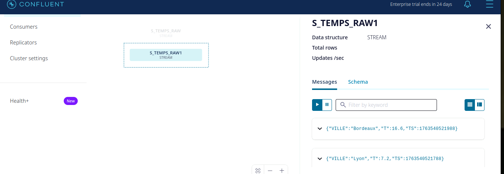

<p align="center"><b>Mamadou Cherif DIALLO - Master 2 Informatique</b></p>

# TP3 ADMINISTRATION BASE DE DONNEES

## Objectifs

L’objectif de ce TP est de se familiariser avec le traitement de flux en temps réel à l’aide de Kafka et ksqlDB. Il s’agit d’apprendre à créer, manipuler et interroger des streams et des tables matérialisées afin de comprendre comment les données en continu peuvent être transformées, agrégées et analysées.
À travers différentes opérations (création de streams, jointures, fenêtres temporelles TUMBLING et HOPPING, calcul de métriques en temps réel), ce TP permet d’acquérir une compréhension concrète des concepts fondamentaux du stream processing.
Les commandes et observations réalisées montrent comment ksqlDB réagit à l’arrivée continue de messages, et comment les agrégations se recalculent dynamiquement selon les fenêtres définies et les dernières valeurs reçues.

````md
# TP Kafka + ksqlDB  
## Rapport complet et structuré

---

# 🌐 **Initialisation des variables d’environnement**

```bash
export BROKER="localhost:9092"
export KSQLDB_URL="http://localhost:8088"
````

## Vérification du serveur ksqlDB

```bash
curl -s "$KSQLDB_URL/info" | jq .
curl -s "$KSQLDB_URL/healthcheck"
```

---

# 1️⃣ **Création du topic `temperatures`**

### Commande correcte

```bash
docker exec -i kafka-1 \
  kafka-topics --bootstrap-server "$BROKER" \
  --create --topic temperatures --partitions 4 --replication-factor 1 --if-not-exists
```

### Vérification du topic

```bash
docker exec -i kafka-1 \
  kafka-topics --bootstrap-server "$BROKER" --describe --topic temperatures
```

---

# 1️⃣.2 **Production de messages dans le topic**

### Script producer (version 1)

```bash
bash -lc 'python3 - <<'"'"'PY'"'"' | docker exec -i kafka-1 \
  kafka-console-producer --bootstrap-server '"$BROKER"' \
  --topic temperatures --property parse.key=true --property key.separator=:
import json,random,time,sys
villes=["Clermont-Ferrand","Lyon","Paris","Bordeaux","Nantes"]
for _ in range(200):
    v=random.choice(villes)
    rec={"ville":v,"t":round(random.uniform(5,35),1),"ts":int(time.time()*1000)}
    print(f"{v}:{json.dumps(rec)}"); sys.stdout.flush(); time.sleep(0.2)
PY'
```

---

# 1️⃣.3 **Vérification dans le Control Center**

Accéder à :

👉 **[http://localhost:9021/](http://localhost:9021/)**

Vérifier :

* Topic `temperatures`
* Nombre de messages dans chaque partition

📌 **Observation : répartition très inégale.**

**Explication :**
Kafka utilise :

```
partition = murmur2(key) % nb_partitions
```

Donc une ville = toujours la même partition.

---

# 1️⃣.4 **Script modifié (Nantes → Montpellier)**

```bash
bash -lc 'python3 - <<'"'"'PY'"'"' | docker exec -i kafka-1 \
  kafka-console-producer --bootstrap-server '"$BROKER"' \
  --topic temperatures --property parse.key=true --property key.separator=:
import json,random,time,sys
villes=["Clermont-Ferrand","Lyon","Paris","Bordeaux","Montpellier"]
for _ in range(200):
    v=random.choice(villes)
    rec={"ville":v,"t":round(random.uniform(5,35),1),"ts":int(time.time()*1000)}
    print(f"{v}:{json.dumps(rec)}"); sys.stdout.flush(); time.sleep(0.2)
PY'
```

### ❓ **Observation**

* Les villes existantes restent dans les mêmes partitions (même hash)
* Montpellier a un hash différent → tombe dans une autre partition

---

# 2️⃣ **Connexion à ksqlDB et exploration des topics**

Dans l’interface KSQLDB du Control Center :

Menu → **ksqlDB Cluster**

Commande :

```sql
SHOW TOPICS;
```

### Résultat observé :

```json
{
  "@type": "kafka_topics",
  "topics": [
    { "name": "commandes", "replicaInfo": [3] },
    { "name": "temperatures", "replicaInfo": [1,1,1,1] }
  ]
}
```

---

# 3️⃣ **Création du stream brut S_TEMPS_RAW1**

```sql
CREATE STREAM S_TEMPS_RAW1 (
  ville STRING,
  t DOUBLE,
  ts BIGINT
) WITH (
  KAFKA_TOPIC='temperatures',
  VALUE_FORMAT='JSON',
  TIMESTAMP='ts'
);
```

### Vérification

```sql
SHOW STREAMS;
```



### Visualisation du flux

Toutes les données :

```sql
SELECT * FROM S_TEMPS_RAW1 EMIT CHANGES;
```

Seulement Paris :

```sql
SELECT * FROM S_TEMPS_RAW1 WHERE ville='Paris' EMIT CHANGES;
```

---

# 3️⃣.2 **Création du stream partitionné par ville**

```sql
CREATE STREAM S_TEMPS_BY_VILLE
WITH (KAFKA_TOPIC='temperatures_by_ville', PARTITIONS=4)
AS
SELECT ville, t, ts
FROM S_TEMPS_RAW1
PARTITION BY ville
EMIT CHANGES;
```

### Vérification

```sql
SHOW STREAMS;
DESCRIBE S_TEMPS_BY_VILLE;
```

📌 **Pourquoi c’est une requête persistante ?**

* lit un stream en continu
* écrit en continu vers un topic
* maintient un état → requête ACTIVE

---

# 4️⃣ **Fenêtres TUMBLING (5 minutes)**

### Création de la table T_MAX_5M

```sql
CREATE TABLE T_MAX_5M AS
SELECT
  ville,
  WINDOWSTART AS w_start,
  WINDOWEND   AS w_end,
  MAX(t)      AS t_max
FROM S_TEMPS_BY_VILLE
WINDOW TUMBLING (SIZE 5 MINUTES, GRACE PERIOD 30 SECONDS)
GROUP BY ville
EMIT CHANGES;
```

### Ce que l’on voit dans “Persistent Queries”

Une entrée comme :

| Query ID        | Type       | Source           | Sink     | Status  |
| --------------- | ---------- | ---------------- | -------- | ------- |
| CSAS_T_MAX_5M_1 | PERSISTENT | S_TEMPS_BY_VILLE | T_MAX_5M | RUNNING |

### Visualisation

```sql
SELECT * FROM T_MAX_5M EMIT CHANGES;
```

📌 **Interprétation :**

* chaque ligne = une fenêtre de 5 min
* `t_max` = température maximale de la fenêtre
* nouvelle fenêtre toutes les 5 min

---

# 5️⃣ **Table des dernières valeurs (T_LAST)**

```sql
CREATE TABLE T_LAST AS
SELECT ville,
       LATEST_BY_OFFSET(t)  AS t_last,
       LATEST_BY_OFFSET(ts) AS ts_last
FROM S_TEMPS_BY_VILLE
GROUP BY ville
EMIT CHANGES;
```

### Comment vérifier ?

Snapshot :

```sql
SELECT * FROM T_LAST;
```

En continu :

```sql
SELECT * FROM T_LAST EMIT CHANGES;
```

### Dernière température pour Lyon :

```sql
SELECT t_last, ts_last
FROM T_LAST
WHERE ville = 'Lyon'
EMIT CHANGES;
```

---

# 7️⃣ **Fenêtres HOPPING (10 min, avance 2 min)**

Création :

```sql
CREATE TABLE T_AVG_10M_HOP2 AS
SELECT
  ville,
  WINDOWSTART AS w_start,
  WINDOWEND   AS w_end,
  AVG(t)      AS t_avg
FROM S_TEMPS_BY_VILLE
WINDOW HOPPING (SIZE 10 MINUTES, ADVANCE BY 2 MINUTES)
GROUP BY ville
EMIT CHANGES;
```

### Visualisation

```sql
SELECT * FROM T_AVG_10M_HOP2 EMIT CHANGES;
```

📌 **Explication claire**

* Fenêtre de 10 minutes
* Une nouvelle fenêtre commence toutes les 2 minutes
* Les fenêtres se chevauchent
* Pour une même ville → plusieurs lignes simultanées

---
